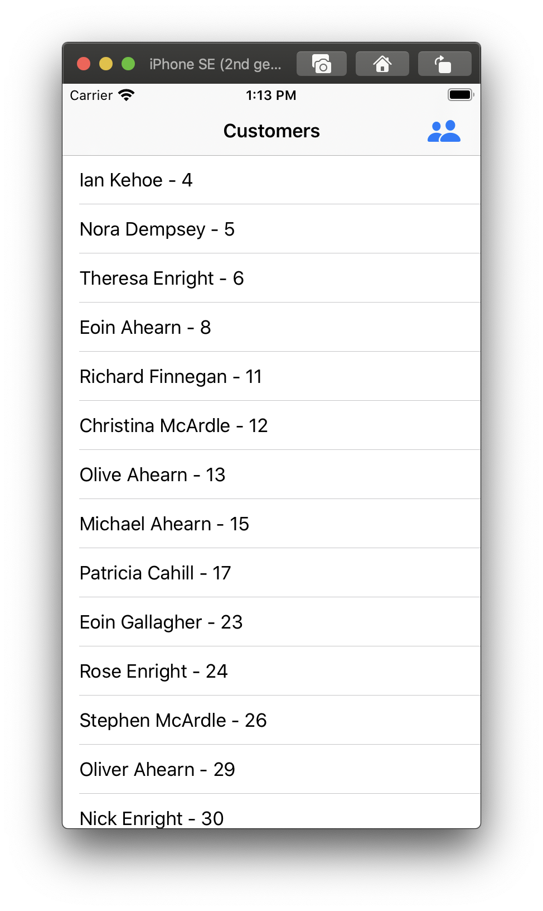

# CustomerList
A sample app to parse and filter customer list from a text file. the text file is a newline seperated collection of json. The app parses the text file and shows the customers within a distance of 100 km from Intercom Dublin coordinates 53.339428, -6.257664.

## Requirements ans Setup

* Xcode 11.4.1 or above
* iOS simulator with OS version 13.4 or above

## Running the app and testing

* Run the "CustumerList" scheme.
* "CustomerListTests" contains all the tests. Ron test on "CustumerList" scheme for tests.
* You can select the filteration by selecting the people logo.

## Implementation

* A "CustomerList" project is created with a app target.
* A test target is created to test the logic.
* The supported behaviours are:
    * On launch the app will show filtered list. Filtered list filtering works as follows:
        * Customers with invalid json value types are filtered.
        * Customers with invalid coordinates.
    * You can show all the parsed customers by selecting the people icon on top right and then selecting "Show all customers" option.

> The Sample app is tested only on simulator as a real device was not available for testing. Not tested with lower deployment target version.

## Screenshots

### Filtered list of customers

### Filtering options

